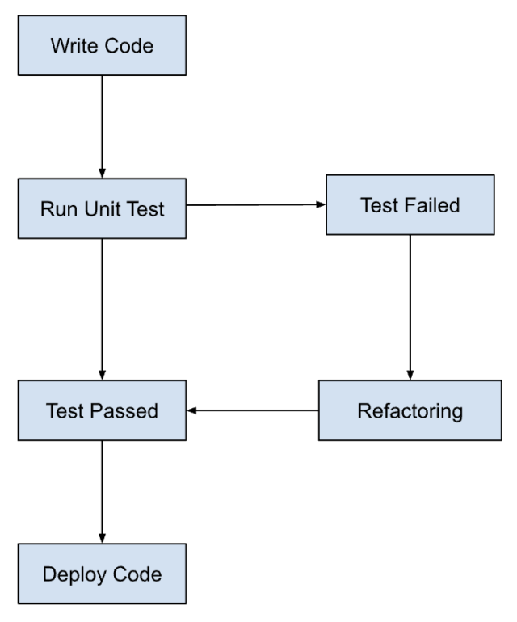

## What is TDD (Test Driven Development)?

**TDD (Test Driven Development)** is a software development process where **tests are written before the actual implementation code**.  
The goal is to ensure that the implemented code satisfies the required behavior through **short feedback loops**.

TDD follows agile development methodology , where feedback loop is integrated fast and development is done iteratively.

### TDD Cycle: Red → Green → Refactor

1. **Red**
   - Write a test that defines a desired feature or behavior.
   - The test should fail initially because the feature is not yet implemented.

2. **Green**
   - Write the **minimum amount of code** required to make the test pass.

3. **Refactor**
   - Improve and optimize the code structure without changing its behavior.
   - Ensure that all tests **continue to pass** after refactoring.

## Best Practices for TDD
1. Write atomic tests - each test should focus on single functionality / behavioural aspect. So each test should be kept small.
2. Write simplest tests first -  begin by writing simplest test case which will fail.
3. Write test case for edge cases - consider boundary conditions of input and add test case for them, often bugs are caught here.
4. Refractor regularly - after test case passes, take time to refractor code and improve its design without change in behaviour.
5. Automation - use test automation tools to fast track the process for testing.
6. Follow Red-Green-Refractory cycle.
7. Maintain fast feedback loop - test suite should execute immediately to receive feedback and accordingly code can be refactored, allowing faster development.
8. Continuous test - integrate test with CI/CD pipelines to automatically execute test whenever code changes are made to ensure early bug detection and feedback addressal.

# Unit Test in Go
1. It needs to be in a file with a name like xxx_test.go
2. The test function must start with the word Test
3. The test function takes one argument only t *testing.T
4. To use the *testing.T type, you need to import "testing", like we did with fmt in the other file